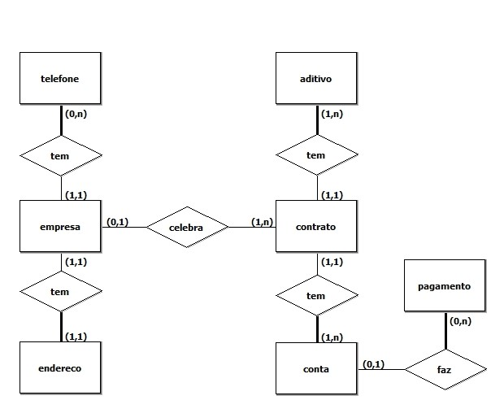

# contrato-api

API Node.js para gestão de contratos com MongoDB

## Modelo de dados

Consulte [https://contrato-api.herokuapp.com/models](https://contrato-api.herokuapp.com/models) para ver o modelo dos documentos.

## Instalação

### MongoDB

* Baixe e instale a versão mais recente do MongoDB [direto do site](https://www.mongodb.com/try/download/community) ou do [Dockerhub](https://hub.docker.com/_/mongo/).

* A aplicação está preparada para acessar o MongoDB via `localhost:27017`.

### Node.js

* Baixe e instale o [Node.js](https://nodejs.org/en/).

* Execute o comando `npm run start` para iniciar a aplicação (configurada para utilizar a porta 3000)

#### Docker

É possível montar um contêiner Docker desta aplicação a partir do arquivo _docker-compose.yml_ na raíz deste repositório. Para tal, execute o comando `docker-compose up -d`.

## Serviços

### _/empresas_

* **GET** `/empresas`
* **GET** `/empresas/:id`
* **POST** `/empresas`
* **PUT** `/empresas/:id`
* **DELETE** `/empresas/:id`

### _/contratos_

* **GET** `/contratos`  _(queryParam: `idEmpresa`, `status`, `tipo`, `prestacao`)_

* **GET** `/contratos/:id`

* **GET** `/contratos/pagamentos` _(queryParam: `idEmpresa`)_ contratos de uma empresa com pagamentos

* **GET** `/contratos/aditivos` _(queryParam: `idEmpresa`)_ contratos de uma empresa com aditivos

* **POST** `/contratos`

* **PUT** `/contratos/:id`

* **DELETE** `/contratos/:id`

#### Enums

* **contrato**

| Campo            | Valores    | Descrição                                         |
|------------------|------------|---------------------------------------------------|
| `tipoContrato`   | [1, 2, 3]  | 1: Licitatório 2: Permanente 3: Consultoria |
| `statusContrato` | [1, 2, 3]  | 1: Ativo 2: Finalizado 3: Cancelado         |
| `prestacao`      | [1, 2]     | 1: Serviço 2: Produto                          |

### _/models_

* **GET** `/models`